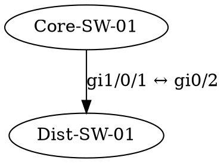

# =============================================================================
# OopsBrain — OOBM 网络拓扑发现 Agent 技能（完整版）
# =============================================================================

## 技能名称

oobm-topology-discovery

## 描述

通过串口服务器（Console Server）的带外管理链路，自动发现企业网络设备拓扑。
读取 Excel 设备清单 → SSH Console 端口逐台采集（LLDP/CDP/ARP/路由/MAC）
→ 等待全量数据汇聚 → 确认端口关联 → 生成拓扑关系图。
支持增量更新和变更检测。

## 归属项目

OpsBrain / oobm-topology

## 工作流

```

                                    ┌──────────────────┐
                                    │  Excel 设备清单     │
                                    └────────┬─────────┘
                                             │
                                    ┌────────▼─────────┐
                                    │  inventory load   │
                                    │  解析/校验/输出JSON│
                                    └────────┬─────────┘
                                             │
                                    ┌────────▼─────────┐
                                    │  collect          │
                                    │  Worker Pool 并行  │
                                    │  ┌──────────┐    │
                                    │  │ SSH 设备A │    │
                                    │  │ SSH 设备B │    │
                                    │  │ SSH 设备C │    │
                                    │  └──────────┘    │
                                    │  ↓ 全部完成       │
                                    └────────┬─────────┘
                                             │
                                    ┌────────▼─────────┐
                                    │  converge (收敛)   │
                                    │  LLDP发现新设备？   │
                                    │  ├─有→继续采集     │
                                    │  └─无→进入关联    │
                                    └────────┬─────────┘
                                             │
                                    ┌────────▼─────────┐
                                    │  link (双向确认)   │
                                    │  A:gi1/0/1↔B:gi0/2│
                                    │  ← 等全部设备数据  │
                                    └────────┬─────────┘
                                             │
                                    ┌────────▼─────────┐
                                    │  render (输出)     │
                                    │  JSON/DOT/Mermaid │
                                    └──────────────────┘
```

## 采集命令

按厂商执行专用命令：

| 厂商 | LLDP/CDP | ARP | MAC | 路由 |
|------|---------|-----|-----|------|
| Cisco | show lldp neighbors detail / show cdp neighbors detail | show arp | show mac address-table | show ip route |
| 华为 | display lldp neighbor-information | display arp | display mac-address | display ip routing-table |
| H3C | display lldp neighbor-information | display arp | display mac-address | display ip routing-table |
| Juniper | show lldp neighbors detail | show arp no-resolve | show ethernet-switching table | show route |
| FortiGate | diagnose lldprx neighbor list | get system arp | - | get router info routing-table all |

## 等待机制（核心）

**为什么需要等待：**
- LLDP/CDP 给出的是**有向边**
- 设备 A 说：端口 gi1/0/1 连着 B
- 设备 B 说：端口 gi0/2 连着 A
- 只有当 **A 和 B 都完成采集**，才能双向确认

**等待逻辑：**

```
Phase 2 采集完所有已知设备
  → 检查 LLDP 是否发现了清单外的新设备
  → 有 → 补充采集（最多 3 轮）
  → 无 → 进入 Phase 3 端口关联
  → 全部确认 → 生成拓扑
  → 未确认 → 标记虚线 + 人工确认
```

## 输出格式

### 1. JSON（结构化）
```json
{
  "nodes": [{"id": "Core-SW-01", "vendor": "cisco"}],
  "links": [{"source": "Core-SW-01", "source_port": "gi1/0/1",
              "target": "Dist-SW-01", "target_port": "gi0/2"}],
  "unconfirmed": [...],
  "end_devices": [...]
}
```

### 2. Mermaid（嵌入飞书文档）


### 3. Graphviz DOT（渲染为图片）


## 运行模式

| 模式 | 流程 | 场景 |
|------|------|------|
| full | load → collect → converge → link → render | 首次全量 |
| collect | 仅采集 | 调试 |
| topology | 基于已有数据出图 | 重新出图 |
| incremental | 增量采集 + 拓扑对比 | 日常巡检 |

## 模型 API 自定义

模型用于: 智能解析 LLDP/CDP 输出、识别未知设备、生成拓扑文字描述。

### 支持任意兼容 OpenAI 的 API

```bash
# DeepSeek（默认）
export OPSBRAIN_MODEL_PROVIDER=deepseek
export OPSBRAIN_MODEL_API_KEY=sk-ds-xxx

# SiliconFlow
export OPSBRAIN_MODEL_PROVIDER=siliconflow
export OPSBRAIN_MODEL_API_KEY=sf-xxx

# 任意自定义端点（兼容 OpenAI 格式即可）
export OPSBRAIN_MODEL_PROVIDER=custom
export OPSBRAIN_MODEL_API_BASE=https://your-proxy.com/v1
export OPSBRAIN_MODEL_API_KEY=sk-xxx
export OPSBRAIN_MODEL_MODEL=your-model-name

# 本地 Ollama
export OPSBRAIN_MODEL_PROVIDER=ollama
export OPSBRAIN_MODEL_API_BASE=http://localhost:11434/v1
export OPSBRAIN_MODEL_MODEL=llama3.2

# 测试连接
opsbrain-oobm model test
```

### 配置项

| 变量 | 默认值 | 说明 |
|------|--------|------|
| OPSBRAIN_MODEL_PROVIDER | deepseek | 模型提供商 |
| OPSBRAIN_MODEL_API_BASE | (自动) | API 地址 |
| OPSBRAIN_MODEL_API_KEY | - | API Key |
| OPSBRAIN_MODEL_MODEL | (自动) | 模型名称 |
| OPSBRAIN_MODEL_MAX_TOKENS | 4096 | 最大输出 Token |
| OPSBRAIN_MODEL_TEMPERATURE | 0.3 | 生成温度 |
| OPSBRAIN_MODEL_TIMEOUT | 60 | 请求超时（秒）|
| OPSBRAIN_MODEL_ENABLED | true | 启用/禁用 |
| OPSBRAIN_MODEL_PARSE_NEIGHBORS | true | 用模型辅助解析 LLDP |
| OPSBRAIN_MODEL_DESCRIBE_TOPOLOGY | true | 用模型生成拓扑描述 |

## 配置项

| 变量 | 默认值 | 说明 |
|------|--------|------|
| OPSBRAIN_WORKERS | 10 | 并发采集数 |
| OPSBRAIN_SSH_TIMEOUT | 30 | SSH 超时 |
| OPSBRAIN_SSH_RETRIES | 2 | SSH 重试 |
| OPSBRAIN_MAX_ROUNDS | 3 | 最大发现轮数 |
| OPSBRAIN_OUTPUT_FORMATS | json,dot,mermaid | 输出格式 |

## 用户交互

### 启动流程时
```
用户：开始拓扑发现，这是设备清单
Agent：收到。开始解析 Excel ...
       共有 15 台设备，Cisco 10 台，华为 3 台，H3C 2 台
       开始采集 ...
```

### 采集进行中
```
Agent：采集进度: 5/15 (Core-SW-01 ✓, Dist-SW-01 ✓, ...)
       已发现 2 台新设备，正在补充采集
       采集进度: 15/17 ...
```

### 输出拓扑时
```
Agent：拓扑构建完成!
       • 设备数: 17
       • 确认链路: 12
       • 未确认链路: 1 (ACC-SW-02 的 gi1/0/24 未找到对端)
       • 终端设备: 8
       
       拓扑图如下：
       [Mermaid 图]
       
       详细信息已保存至 data/topology/
```

## 约束

- 只执行 show/display 命令，不写配置
- 密码通过 `${ENV_VAR}` 引用，不在 Excel 明文
- 每条命令超时 15s，整台设备超时 90s
- 断连按指数退避重试 2 次
